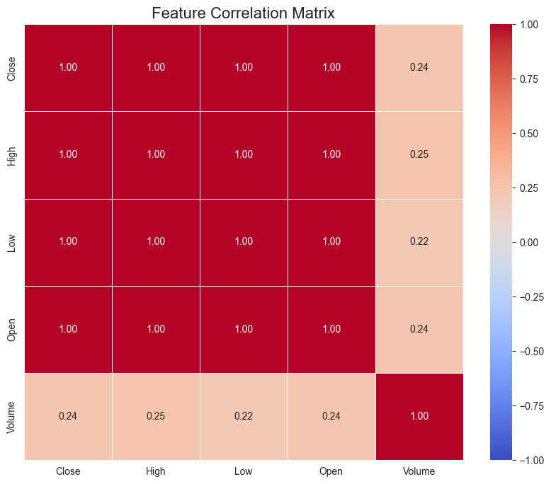
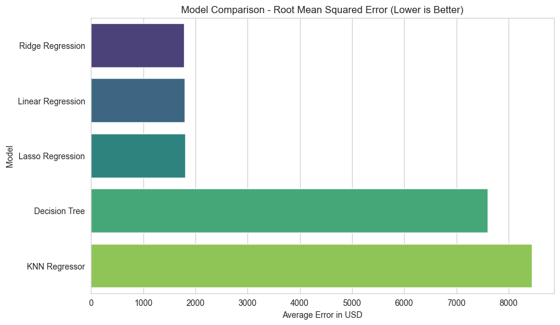

# CryptoGigel: Bitcoin Price Prediction & Trend Analysis AI

   

## 📄 Project Overview
**CryptoGigel** is an end-to-end Machine Learning project developed to analyze historical Bitcoin data and predict future market movements. The project addresses two distinct machine learning tasks using data from **Yahoo Finance (2020-2024)**:

1.  **Regression:** Predicting the exact closing price of Bitcoin for the next day (USD).
2.  **Classification:** Predicting the market direction (UP/DOWN) for the next day.

The project implements the complete ML pipeline: Data Collection, Exploratory Data Analysis (EDA), Feature Engineering (Technical Indicators), Model Training, Ensemble Learning, and Production Deployment via a GUI.

---

## 📂 Project Structure

```text
ML_Crypto_Project/
│
├── data/
│   ├── raw/                 # Original CSV data downloaded from Yahoo Finance
│   └── processed/           # Cleaned data with calculated technical indicators (SMA, RSI)
│
├── notebooks/               # Jupyter Notebooks for experiments
│   ├── 1_EDA_Visualization.ipynb       # Statistical summaries & Visualizations
│   ├── 2_Preprocessing.ipynb           # Feature Engineering & Target Creation
│   ├── 3_Regression_Models.ipynb       # Training 5 Regression Models
│   ├── 4_Classification_Models.ipynb   # Training 5 Classification Models
│   └── 5_Ensemble_Methods.ipynb        # Voting & Gradient Boosting techniques
│
├── models/                  # Saved serialized models (.pkl) for the app
│   ├── crypto_price_model.pkl
│   └── scaler.pkl
│
├── app/                     # Streamlit GUI Application
│   └── main.py
│
├── README.md                # Project Documentation
└── requirements.txt         # List of dependencies
````

-----

## 📊 1. Data Analysis & EDA

**Objective:** Understand the structure, distribution, and correlation of financial data.

  * **Dataset Source:** `yfinance` API (Ticker: BTC-USD).
  * **Timeframe:** Jan 1st, 2020 - Dec 1st, 2024.
  * **Key Insights:**
      * The dataset contains Open, High, Low, Close, and Volume.
      * **Correlation:** `Open`, `High`, `Low`, and `Close` are highly correlated (0.99). `Volume` shows weaker correlation, acting as an independent signal.
      * **Distribution:** Price data is right-skewed (not normally distributed), indicating a long-term upward trend with high volatility.



-----

## 🛠️ 2. Preprocessing & Feature Engineering

Since raw financial prices are insufficient for prediction, we engineered **Technical Indicators** to provide context to the models.

**Transformations Applied:**

1.  **SMA\_7 & SMA\_30:** Simple Moving Averages to capture short-term and long-term trends.
2.  **RSI (Relative Strength Index):** Momentum indicator to identify Overbought (\>70) or Oversold (\<30) conditions.
3.  **Volatility:** Rolling standard deviation over 7 days.
4.  **Pct\_Change:** Daily percentage return.
5.  **Scaling:** Applied `StandardScaler` to normalize features (Mean=0, Std=1), essential for algorithms like KNN and SVM.

**Time Series Split:**

  * **Crucial Step:** Data was split **sequentially** (Train: 2020-2023, Test: 2024). Random shuffling was disabled to prevent data leakage (the model cannot "see" the future).

-----

## 🤖 3. Model Training & Results

### A. Regression (Price Prediction)

We trained 5 distinct models to predict the `Target_Next_Close`.

| Model | RMSE (Error in $) | R2 Score | Verdict |
| :--- | :--- | :--- | :--- |
| **Ridge Regression** | **~$1,783** | **0.97** | **Best Model** |
| Linear Regression | ~$1,796 | 0.97 | Excellent Baseline |
| Lasso Regression | ~$1,803 | 0.97 | Good |
| Decision Tree | ~$7,600 | 0.59 | Overfitted/Poor |
| Gradient Boosting | ~$7,800 | 0.55 | Failed to extrapolate trend |

> **Observation:** Linear models (Ridge) performed best because Bitcoin showed a strong linear upward trend in the test period (2024) which tree-based models failed to extrapolate beyond the training range.



### B. Classification (Trend Prediction)

We trained 5 models to predict `Target_Direction` (1 = UP, 0 = DOWN).

| Model | Accuracy | F1-Score |
| :--- | :--- | :--- |
| **Logistic Regression** | **~50.85%** | 0.42 |
| Random Forest | ~50.85% | 0.45 |
| SVM (RBF) | 50.00% | 0.00 |

> **Observation:** The results confirm the **Random Walk Theory**, suggesting that short-term daily price movements are highly stochastic and difficult to predict solely based on past price history.

-----

## 🤝 4. Ensemble Methods

We attempted to improve performance using **Voting Ensembles** and **Gradient Boosting**.

  * **Regression Ensemble:** Combined Linear + Ridge + Gradient Boosting.
      * Result: The ensemble performed worse than the simple Ridge model due to the negative impact of the tree-based components.
  * **Classification Ensemble:** Voting Classifier (Soft Voting).
      * Result: Maintained accuracy around \~51%.

**Conclusion:** The **Ridge Regression** model was selected for deployment as it offered the lowest error and highest stability.

-----

## 🚀 5. Deployment (GUI)

The best model was saved and deployed using **Streamlit**. The application allows users to input current market data and technical indicators to receive a real-time price prediction.

**Features:**

  * User-friendly sidebar for inputting OHLC and Indicators (RSI, Volatility).
  * Real-time calculation of predicted price.
  * Visual feedback on expected market movement (Up/Down).


-----

## 💻 Installation & Usage

1.  **Clone the repository:**

    ```bash
    git clone https://github.com/AlbertoMitroi/ML_CryptoGigelAI.git
    cd ML_CryptoGigelAI
    ```

2.  **Install dependencies:**

    ```bash
    pip install -r requirements.txt
    ```

3.  **Run the Notebooks (Optional):**
    Navigate to `notebooks/` and run them in order (1 to 5) to reproduce the training process.

4.  **Run the App:**

    ```bash
    streamlit run app/main.py
    ```

-----

## 📚 Requirements

  * Python 3.x
  * pandas
  * numpy
  * scikit-learn
  * matplotlib
  * seaborn
  * yfinance
  * streamlit

-----

**Author:** Alberto Mitroi
**Academic Year:** 2025-2026

```
```
